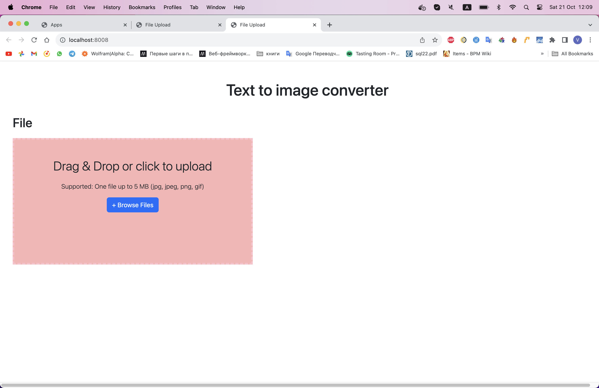
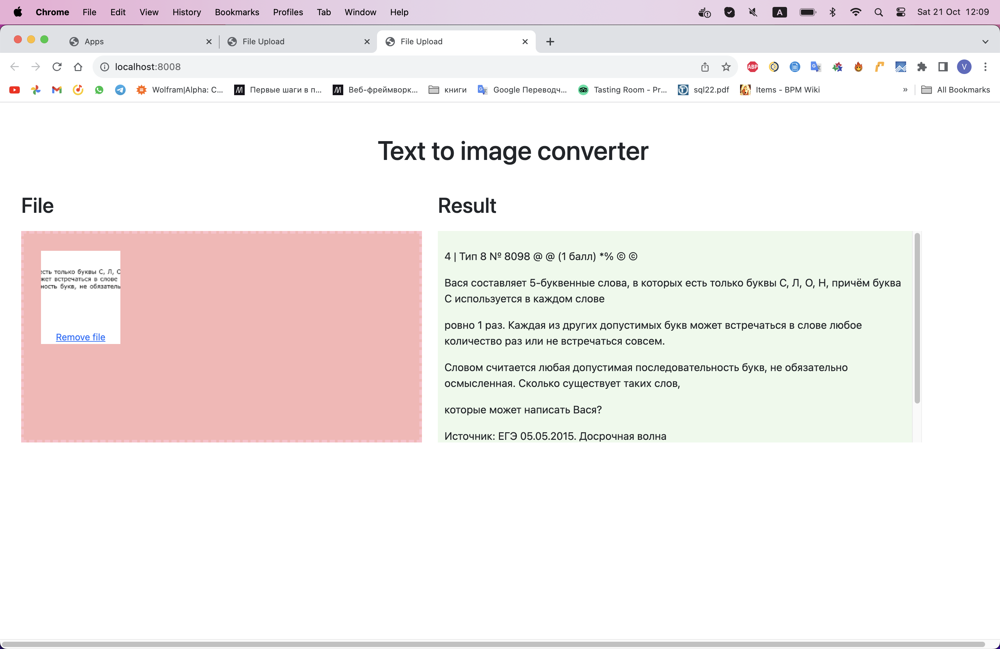

# Text Recognition Web Application

This is a web application that allows users to upload images and performs text recognition on them using Tesseract OCR. The application provides a user-friendly interface for uploading images and viewing the recognized text.

## Features

- User-friendly drag and drop interface for uploading images.
- Text recognition using Tesseract OCR.
- Supports one file up to 5 MB in formats .jpg, .jpeg, .png, .gif.
- Real-time display of recognized text.
- Easy-to-use and responsive design.

## Inside
- Simple REST API
- Docker/docker-compose

#### Screenshot




## Technologies Used

- [FastAPI](https://fastapi.tiangolo.com/): A modern, fast (high-performance) web framework for building APIs with Python.
- [Tesseract OCR](https://github.com/tesseract-ocr/tesseract): An OCR engine for various platforms.
- [Dropzone.js](https://www.dropzonejs.com/): An open-source library that provides drag and drop file uploads with image previews.
- [Docker](https://www.docker.com/): Containerization platform for deploying applications in containers.

## Installation

### Using Docker Compose

1. Clone the repository:

   ```bash
   git clone https://github.com/yourusername/your-repo.git
   cd your-repo
   ```

2. Create a `.env` file for configuration (if not already present). You can use the provided `.env.example` as a template.

3. Build and start the Docker containers:

   ```bash
   docker-compose build
   docker-compose up -d
   ```

4. The application will be accessible at `http://localhost:8000`.

## Usage

1. Open the application in your web browser.
2. Drag and drop an image onto the dropzone or click to select a file.
3. The application will recognize the text on the image using Tesseract OCR.
4. The recognized text will be displayed on the page.

## License

This project is licensed under the MIT License - see the [LICENSE](LICENSE) file for details.

## Acknowledgments

- The project uses the [Tesseract OCR](https://github.com/tesseract-ocr/tesseract) library for text recognition.

---